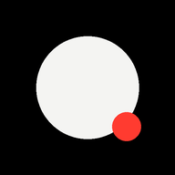

  

  # Luz de Tela

  **Uma luz ajustável que funciona direto no navegador.**

  Transforme a tela do celular, tablet ou computador em uma fonte de luz suave para o quarto, a mesa, uma chamada ou uma foto.

  [**Abrir o Luz de Tela**](https://generosorafa.github.io/luz-de-tela/)

---

## A luz certa, na hora em que precisar

Nem sempre a lanterna é a melhor escolha. Ela pode ser forte demais, concentrada demais ou simplesmente desconfortável em um ambiente escuro.

O **Luz de Tela** oferece uma iluminação ampla e controlável usando a tela que já está com você. Abra, escolha uma cor, ajuste a intensidade e acenda.

## Para o dia a dia

- Iluminação suave durante a noite.
- Luz de apoio para leitura rápida ou para encontrar objetos.
- Preenchimento próximo para selfies, retratos e fotos de produtos.
- Apoio de luz em videochamadas.
- Cores livres para criar ambientes e efeitos visuais.

## Simples por escolha

- Começa com a tela preta, sem claridade inesperada.
- Vermelho noturno em destaque e tons de branco prontos para uso.
- Seletor RGB para qualquer outra cor.
- Intensidade ajustável antes de acender.
- Ajuste de intensidade com um gesto vertical enquanto a luz está acesa.
- Tela de luz limpa, sem botões sobre a iluminação.
- Um toque em qualquer lugar apaga a luz.
- A última configuração fica salva no próprio aparelho.

## Um site que se comporta como aplicativo

O Luz de Tela pode ser adicionado à tela inicial e aberto como um app. Quando compatível com o navegador, ele também tenta manter a tela acordada e usar toda a área disponível durante a iluminação.

Depois do primeiro acesso, os arquivos essenciais podem continuar disponíveis mesmo sem conexão.

## Privacidade sem atrito

Sem cadastro, sem conta e sem dados pessoais. As preferências de cor e intensidade ficam somente no dispositivo usado.

## Para fotos e vídeos

O Luz de Tela funciona melhor como uma luz de preenchimento próxima ao rosto ou ao objeto fotografado. A potência final depende da tela e do brilho configurado no aparelho, por isso ele complementa uma iluminação simples, mas não pretende substituir um painel de LED profissional.

---

  <strong>Luz de Tela.</strong> 
  Uma ideia simples para quando você precisa de luz, mas não de uma lanterna.

